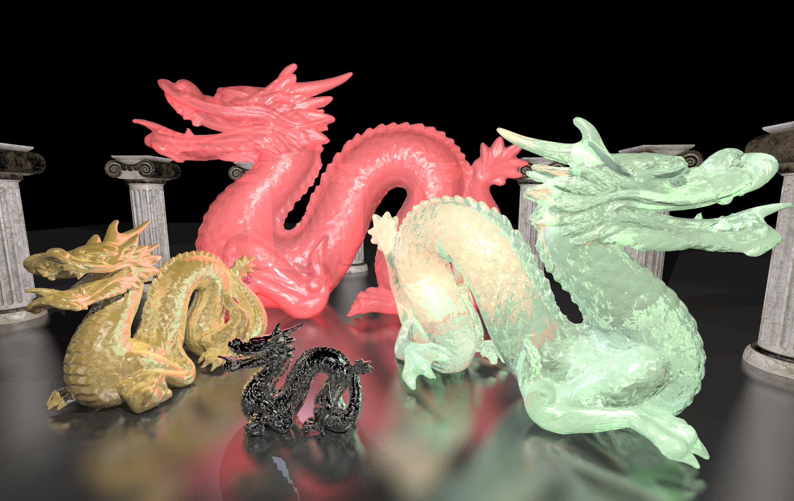
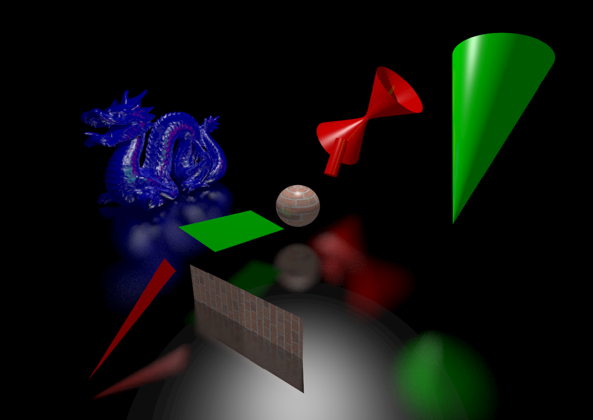
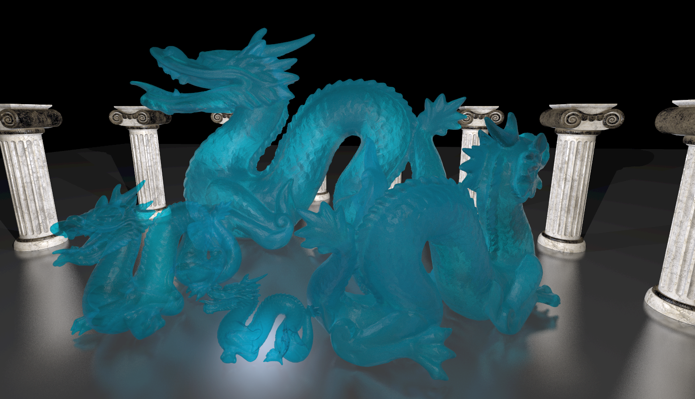
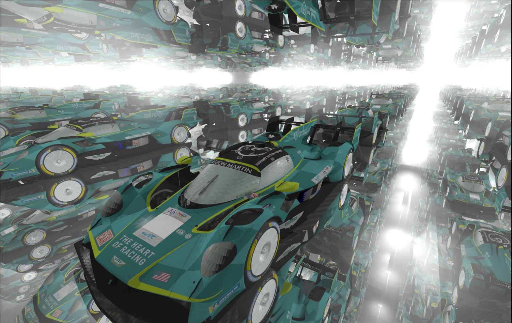

# MiniRT — My first Ray Tracer



> Un ray tracer complet écrit en C, avec support des matériaux, textures, BVH, multi-threading et chargement de modèles OBJ.

---

## Table des matières

- [Introduction](#introduction)
- [La caméra, Viewport et FOV](#la-caméra-viewport-et-fov)
- [Les formes géométriques](#les-formes-géométriques)
- [Les matrices](#les-matrices)
- [L'éclairage — modèle de Phong](#léclairage--modèle-de-phong)
- [Anti-aliasing](#lanti-aliasing)
- [Textures et effets visuels](#textures-et-effets-visuels)
- [Physique avancée — nouveaux types de rayons](#physique-avancée--nouveaux-types-de-rayons)
- [Optimisations de performance](#optimisations-de-performance)
- [Format OBJ / MTL](#format-obj--mtl)
- [Parsing optimisé](#parsing-optimisé)
- [Utilisation du projet](#utilisation-du-projet)
- [Contrôles](#contrôles-version-bonus)
- [Utilisation de l'IA](#utilisation-de-lia)
- [Sources](#sources)
- [Fin](#fin)

---

## Introduction

### Qu'est-ce que le Ray Tracing ?

Le ray tracing, aussi appelé **lancer de rayons**, est une technique de calcul d'optique par ordinateur, utilisée pour les jeux vidéo, les effets spéciaux CGI et les films d'animation. Elle consiste à faire le parcours inverse de la lumière : au lieu de lancer les rayons depuis les sources de lumière, on lance tout depuis la caméra, on regarde où ils touchent, et après on regarde comment ces endroits sont illuminés. Cette technique avancée permet de reproduire les phénomènes physiques de la vraie vie comme la réflexion et la réfraction.

Le ray tracing fut présenté pour la première fois par **Arthur Appel en 1968**.

Il a ensuite beaucoup été utilisé pour la création de films d'animation connus ou la création d'effets spéciaux CGI — des films comme *Toy Story* ou *Le Monde de Nemo* ont utilisé le ray tracing, mais avec des temps de rendu de plusieurs heures pour une seule image.

Le ray tracing demande une quantité astronomique de calcul, ce qui a compliqué son utilisation dans les jeux vidéo. Mais l'arrivée de cartes graphiques dotées de cœurs dédiés au ray tracing (**NVIDIA RTX**, **AMD RDNA2**) à partir de 2018 a marqué un tournant : le ray tracing temps réel est devenu une réalité pour les gamers.

---

## La caméra, Viewport et FOV

Pour rendre une scène en ray tracing, il faut d'abord créer la scène en 3D avec les lumières, les objets et tous leurs attributs (taille, couleur, transparence, …), puis une fois la caméra placée, on positionne plus ou moins loin de la caméra le **viewport** — un écran en 2D faisant exactement la même taille que la fenêtre, donc exactement le même nombre de pixels. Par la suite on lance un rayon au milieu de chaque pixel du viewport et on regarde ce qu'il touche dans la scène. Une fois que l'on sait, on colorie le pixel de la même couleur que l'objet touché.

La FOV dépend justement de la distance et de la dimension du viewport (principalement la dimension) entre le viewport et la caméra.

```c
/*
    formule fov equation
    Height = 2 × tan(FOV/2) × FocalLength
*/
void	set_viewport(t_data *data, t_vec3 origin, t_vec3 dir, double fov)
{
    // On définit la fov en radian au lieu de degree parce que tan sin cos prennent des radians
    data->view_port.fov_radians = data->cam.fov * (PI / 180.0);
    // On définit la distance
    data->view_port.focal_length = 1.0;
    // La hauteur va varier selon la fov, on applique la formule
    data->view_port.viewport_height = 2.0
        * tan(data->view_port.fov_radians / 2.0) * data->view_port.focal_length;
    // On regarde sur la vraie fenêtre le ratio entre la hauteur et la largeur
    data->view_port.aspect_ratio = (double)data->width
        / (double)data->height;
    // On applique ce même ratio pour obtenir la largeur du viewport à l'aide de sa hauteur
    data->view_port.viewport_width = data->view_port.aspect_ratio
        * data->view_port.viewport_height;
}
```

---

## Les formes géométriques

Maintenant que l'on lance des rayons à travers le viewport, comment savoir s'il touche ou non un objet ?

### La sphère

```
t l'inconnu, D direction rayon, O origine
Ray(t) = O + t * D

c centre de la sphère
tous les points f d'une sphère :
||f - c|| = r
(f - c) * (f - c) = r²

On remplace f par le rayon :
((O + t * D) - C) * ((O + t * D) - C) = r²
(OC + TD) * (OC + TD) = r²

(a + b)² = a² + 2ab + b²

(OC * OC) + 2(OC * TD) + TD² = r²
(OC * OC) + 2t(OC * D) + t²(D * D) = r²
(OC * OC) + 2t(OC * D) + t²(D * D) - r² = 0

Si cette équation est vraie, le rayon touche la sphère.
```

### Le plan

```
rayon = t*D + O
plan : y = 0
t*D + O = 0
t*D = -O
t = -O / D
```

### Le triangle — algorithme Möller–Trumbore

Pour le triangle, il existe plusieurs manières. La plus courante est de faire un plan à partir du triangle puis faire une équation de plan, mais il y a encore plus rapide : l'algorithme standard du ray tracing pour triangle — **Möller–Trumbore**.

Pour cela on utilise les **coordonnées barycentriques** qui représentent le poids des sommets.

```
Dans un triangle avec sommets P1, P2, P3 :
n'importe quel point P dans le triangle peut s'écrire comme :

    P = w*P1 + u*P2 + v*P3

avec la contrainte :
    w + u + v = 1
et
    0 ≤ u, v, w ≤ 1

On appelle (w, u, v) les coordonnées barycentriques.
```

**Pourquoi c'est parfait pour un triangle ?**

Un point est dans le triangle si :
- `u >= 0`
- `v >= 0`
- `u + v <= 1` (car `w = 1 - u - v`)

Donc un simple test suffit. De plus les interpolations sont faciles, donc l'ajout d'UV, normales, tangentes ou même dégradé est plutôt simple.

**Déroulement de l'algorithme :**

```
On part du rayon :
    R(t) = O + t * D
    O : origine du rayon
    D : direction
    t : distance le long du rayon

On calcule les deux arêtes du triangle :
    E1 = P2 - P1
    E2 = P3 - P1

Puis on fait quelques produits vectoriels pour résoudre le système :
    H = D x E2
    a = E1 . H

Si a est proche de 0, le rayon est parallèle au triangle → pas d'intersection.

Sinon on continue :
    f = 1 / a
    S = O - P1
    u = f * (S . H)

    si u < 0 ou u > 1 → pas d'intersection

    Q = S x E1
    v = f * (D . Q)

    si v < 0 ou u + v > 1 → pas d'intersection

On calcule enfin t, la distance sur le rayon :
    t = f * (E2 . Q)

Si t > 0, le rayon touche le triangle au point :
    P = O + t * D

Coordonnées barycentriques récupérées :
    u, v déjà calculés
    w = 1 - u - v
```

Le cylindre, le cône et l'hyperboloïde sont plutôt similaires mais un peu plus complexes, donc on va passer…

---

## Les matrices

Dans MiniRT on doit pouvoir appliquer des transformations aux objets :
- translation (déplacer un objet)
- rotation
- mise à l'échelle (scale)

Ces transformations peuvent s'appliquer à un objet, un point, un rayon ou une normale.

Pour simplifier tous ces calculs, on utilise des **matrices 4×4** :

```
| a b c d |
| e f g h |
| i j k l |
| m n o p |
```

Elle permet de transformer un vecteur ou un point avec une multiplication matricielle.

Mathématiquement, une sphère étirée devient une forme plus compliquée (comme un ballon de rugby). Au lieu de recalculer une nouvelle équation compliquée, on fait une astuce :

1. On calcule l'**inverse** de la matrice de transformation
2. On applique cette matrice **au rayon**
3. On teste l'intersection avec une sphère simple de rayon 1

```c
// Application de la matrice inverse d'une sphère au rayon
l_ray.origin = mat4_mult_vec3(&sp->inverse_transform, ray.origin, 1.0);
l_ray.dir    = mat4_mult_vec3(&sp->inverse_transform, ray.dir, 0.0);
```

> Au lieu de transformer l'objet, on transforme le rayon dans l'espace de l'objet. Cela permet de garder des équations simples pour toutes les primitives.

---

## L'éclairage — modèle de Phong



Maintenant qu'on arrive à rendre des objets, il reste à appliquer des normales sur ces objets. Pour cela on utilise le **modèle de Phong**, qui fonctionne avec 3 composantes d'éclairage :

| Composante | Description |
|---|---|
| **Ambiante** | Touche n'importe quel endroit — imite les rebonds de lumière dans la vraie vie. La lumière ambiante est supposée égale en tout point de l'espace. |
| **Diffuse** | Réfléchie dans toutes les directions. On prend en compte l'inclinaison de la surface pour attribuer la luminosité. |
| **Spéculaire** | Représente la lumière renvoyée dans la direction de la réflexion géométrique. C'est elle qui crée par exemple la tache blanche sur une pomme fortement éclairée. |

On applique ces trois types de lumière à un objet pour avoir la couleur finale renvoyée par le point touché.

---

## L'anti-aliasing

L'anti-aliasing est aussi utilisé en path tracing. C'est une version plus optimisée du ray tracing : plus on augmente le nombre de rayons par pixel, plus le rendu devient réaliste.

Au départ, on envoyait un **seul rayon par pixel** depuis le viewport, passant par le centre du pixel. Le problème : si un pixel touche la sphère et que celui d'à côté ne la touche pas, la transition est très brutale → effets d'escalier.

L'anti-aliasing consiste à envoyer **plusieurs rayons dans un même pixel**, à des positions aléatoires à l'intérieur de celui-ci, puis à faire la **moyenne des couleurs** obtenues. Cela permet d'obtenir une image plus lisse, avec des ombres moins marquées et un rendu plus réaliste.

> Le point négatif est que cette méthode demande beaucoup plus de calculs : 100 rayons par pixel nécessitent environ 100× plus de temps de calcul.

---

## Textures et effets visuels

### Checkerboard Pattern

Le checkerboard pattern (motif en damier) est une texture procédurale qui alterne deux couleurs pour créer un effet de cases comme un échiquier.

```
Principe :
1. On récupère les coordonnées UV du point sur l'objet.
2. On multiplie ces coordonnées par une échelle pour contrôler la taille des cases.
3. On applique floor() pour obtenir un indice de case.
4. On additionne les indices u et v.
   → Si le résultat est pair : color_a
   → Sinon : color_b
```

```c
if ((floor(u * scale) + floor(v * scale)) % 2 == 0)
    couleur = color_a;
else
    couleur = color_b;
```

### UV Mapping sur une sphère

Pour appliquer une texture sur une sphère, on transforme la normale du point d'impact en coordonnées UV :

```
phi   = angle autour de la sphère (longitude)
theta = angle vertical (latitude)

Ces angles sont normalisés entre 0 et 1 pour obtenir u et v.
Cela permet de projeter correctement une texture 2D sur une sphère.
```

### Bump Map

Une bump map sert à **simuler du relief** sans modifier la géométrie de l'objet.

```
Principe :
- On utilise une texture (souvent en niveaux de gris).
- La valeur de la texture modifie légèrement la normale de la surface.
- L'éclairage réagit comme si la surface avait des bosses ou des creux.

Important :
- La forme réelle de l'objet ne change pas.
- Seul le calcul de la lumière est modifié.
```

> Résultat : un effet de relief peu coûteux en calcul — on peut voir des effets de craquelure sur du bitume ou de vaguelettes sur l'eau.

---

## Physique avancée — nouveaux types de rayons



Pour pousser le réalisme plus loin, on peut ajouter des **rebonds** aux rayons sur les surfaces.

### Rayons spéculaires (miroirs)

Les rayons spéculaires permettent de créer des miroirs — ils font des rebonds parfaits. Pour un effet métallique, j'ai ajouté la **roughness** qui perturbe légèrement les rebonds pour créer un flou métallique.

La méthode utilisée s'appelle le **sphere fuzz** : au bout du rebond parfait, on crée un cercle d'une taille dépendant du taux de roughness, et le rayon rebondit vers un point aléatoire dans ce cercle.

### Rayons diffuse

Les rayons diffuse créent beaucoup de bruit si le nombre de rayons par pixel est bas, car ils consistent à envoyer un rayon vers une direction complètement aléatoire. Le point touché devient une source de lumière pour l'objet touché de base. Ce bruit est atténué par l'anti-aliasing.

### Rayons réfractés (transparence)

Les rayons réfractés permettent de simuler les matériaux transparents. La réfraction correspond à la manière dont la lumière traverse les différentes matières (huile, diamant, etc.) de manière réaliste.

---

## Optimisations de performance



Pour que le rendu reste rapide même avec des scènes très chargées (beaucoup d'objets ou des milliers de triangles comme dans `dragon.obj`), MiniRT utilise deux grosses optimisations.

### BVH — Bounding Volume Hierarchy

Au lieu de tester chaque rayon contre tous les objets de la scène un par un, le programme organise tous les objets dans un **arbre hiérarchique d'enveloppes englobantes** (des boîtes). Chaque nœud de l'arbre représente une boîte qui contient soit des objets, soit d'autres boîtes plus petites. Grâce à cela, le rayon peut sauter directement des zones entières de la scène qui ne l'intéressent pas.

L'arbre est construit de façon intelligente grâce à l'heuristique **SAH** (Surface Area Heuristic). Cette méthode calcule pour chaque découpage possible le coût en surface et choisit le meilleur moyen de séparer les objets pour minimiser le nombre de tests inutiles.

### Thread Pool

Le calcul de l'image est fait en parallèle sur plusieurs cœurs du processeur. Au lieu de créer et détruire des threads à chaque fois, MiniRT utilise un **thread pool** qui garde un groupe de threads prêts à travailler.

Le programme divise l'image en petits blocs de pixels et les distribue automatiquement aux threads disponibles grâce aux fonctions du dossier `thread_pool/`. Chaque thread calcule sa partie de l'image en même temps. Chaque cœur doit traiter un nombre `n` de groupes de pixels.

---

## Format OBJ / MTL

MiniRT peut charger des modèles 3D réalistes grâce au format `.obj` accompagné de son fichier de matériaux `.mtl`.

Le format `.obj` (créé dans les années 1980 par la société Wavefront) est l'un des formats les plus utilisés en 3D. Il contient :
- Les sommets (vertices)
- Les normales
- Les faces triangulaires

Le fichier `.mtl` décrit les propriétés des matériaux associés : couleurs (`Kd` pour diffuse, `Ks` pour spéculaire), brillance (`Ns`), textures, opacité, indice de réfraction (`Ni`), etc.

C'est grâce à ce format que l'on peut charger des objets complexes comme le dragon, l'avion (`f16.obj`), Shrek ou le lapin (`bun_small.obj`). Même si ce format commence à être un peu ancien, il reste très pratique et largement supporté par tous les logiciels 3D (Blender, Maya…).

---

## Parsing optimisé

Pour charger rapidement les gros fichiers `.obj` qui peuvent contenir des dizaines de milliers de triangles, j'ai utilisé la fonction système `mmap` et `realloc`.

Contrairement à la lecture classique ligne par ligne avec `getline` ou `fscanf`, `mmap` met le fichier entier directement en mémoire comme s'il faisait partie du programme. Cela rend l'accès aux données beaucoup plus rapide.

Le parsing analyse en même temps :
- La géométrie (triangles, normales, vertices)
- Les matériaux du fichier `.mtl` associé

---

## Utilisation du projet

```bash
make          # version mandatoire
make bonus    # version goatesque (conseillée)
```

```bash
./minirt_bonus <scenes.rt>
```

> Beaucoup de scènes déjà sympas sont disponibles dans le dossier `scenes/`

---

## Contrôles (version bonus qwerty)

| Touche | Action |
|--------|--------|
| `W` `A` `S` `D` | Déplacement |
| `↑` `↓` `←` `→` | Mouvement caméra |
| `Space` | Monter |
| `Shift droit` | Descendre |
| `[` `]` | Rotation de la scène sur l'axe Z |
| `-` / `=` | Diminuer / augmenter la FOV |
| `0` / `9` | Augmenter / diminuer le nombre de rebonds |
| `1` | 1 sample par pixel |
| `2` | 5 samples par pixel |
| `3` | 10 samples par pixel |
| `4` | 30 samples par pixel |
| `5` | 100 samples par pixel |
| `C` | Activer / désactiver la vue du checkerboard pattern |
| `Del` | Activer / désactiver les rebonds diffus |
| `Ctrl` | Activer / désactiver le speed mode |
| `Enter` | Activer / désactiver le BVH |
| `B` | Activer / désactiver la vue de debug BVH |
| `L` | Activer / désactiver la vue de la répartition des tâches |
| `Esc` | Quitter |

---

## Utilisation de l'IA

Pour ce projet, je n'ai presque pas utilisé l'IA. Je m'en suis surtout servi pour comprendre certaines formules mathématiques, notamment celles de l'hyperboloïde. Au départ, je ne comprenais pas bien ces formules, j'ai donc demandé à l'IA de me les expliquer. Je préfère cela plutôt que d'écrire quelque chose que je ne comprends pas.

Pour la plupart des autres formes, la documentation disponible est très claire et complète, mais certaines subtilités sont moins bien expliquées, ce qui m'a amené à demander quelques précisions.

J'ai également utilisé l'IA pour reformuler ou améliorer certains fichiers `.rt` pour avoir des map style ou MTL afin d'obtenir des matériaux plus réalistes. Il ne s'agit donc pas de génération de code, mais plutôt d'une aide pour la rédaction et l'ajustement de paramètres visuels.
J'ai également demandé de l'aide à l'IA pour le markdown, mais tout le contenu a été écrit à la main (merci à reverso pour la correction des fautes d'orthographe).

## Sources

> Beaucoups sources sont manquantes, voici celles que j'avais notées.

---

**Ray Tracing — bases**

- *<sub>https://www.scratchapixel.com/lessons/3d-basic-rendering/ray-tracing-generating-camera-rays/generating-camera-rays.html</sub>*
- *<sub>https://raytracing.github.io/books/RayTracingInOneWeekend.html</sub>* — merci pour ce guide, c'est un très bon point de départ pour commencer de zéro…
- *<sub>https://fr.wikipedia.org/wiki/Ray_tracing</sub>*
- *<sub>https://www.scratchapixel.com/lessons/3d-basic-rendering/ray-tracing-overview/light-transport-ray-tracing-whitted.html</sub>*

**Vidéos**

- *<sub>https://www.youtube.com/watch?v=iOlehM5kNSk&t=1202s</sub>* — la meilleure vidéo ever sur le ray tracing
- *<sub>https://www.youtube.com/watch?v=Qz0KTGYJtUk</sub>* — merci énormément, ça m'a donné plein d'idées et surtout plein de réponses…

**Formes géométriques**

- *<sub>http://heigeas.free.fr/laure/ray_tracing/sphere.html</sub>*
- *<sub>http://heigeas.free.fr/laure/ray_tracing/cylindre.html</sub>*
- *<sub>https://www.britannica.com/science/hyperboloid</sub>*

**Format OBJ / MTL**

- *<sub>https://en.wikipedia.org/wiki/Wavefront_.obj_file</sub>*
- *<sub>https://www.fileformat.info/format/wavefrontobj/egff.htm</sub>*
- *<sub>https://people.sc.fsu.edu/~jburkardt/data/mtl/mtl.html</sub>*

**Éclairage & Phong**

- *<sub>https://fr.wikipedia.org/wiki/Ombrage_de_Phong</sub>*
- *<sub>https://rodolphe-vaillant.fr/entry/85/phong-illumination-model-cheat-sheet</sub>*
- *<sub>https://www.povray.org/documentation/view/3.60/348/</sub>*
- *<sub>https://computergraphics.stackexchange.com/questions/9065/diffuse-lighting-calculations-in-ray-tracer</sub>*

**Réflexion, réfraction & Fresnel**

- *<sub>https://blog.demofox.org/2017/01/09/raytracing-reflection-refraction-fresnel-total-internal-reflection-and-beers-law/</sub>*
- *<sub>https://fr.wikipedia.org/wiki/Coefficients_de_Fresnel</sub>*
- *<sub>https://nano-optics.ac.nz/planar/articles/fresnel.html</sub>*
- *<sub>https://www.rp-photonics.com/fresnel_equations.html</sub>*
- *<sub>https://fr.wikipedia.org/wiki/Loi_de_Beer-Lambert</sub>*
- *<sub>https://learn.arm.com/learning-paths/mobile-graphics-and-gaming/ray_tracing/rt08_refractions/</sub>*
- *<sub>https://stackoverflow.com/questions/26087106/refraction-in-raytracing</sub>*

**Roughness & anti-aliasing**

- *<sub>https://computergraphics.stackexchange.com/questions/4486/mimicking-blenders-roughness-in-my-path-tracer</sub>*
- *<sub>https://computergraphics.stackexchange.com/questions/4248/how-is-anti-aliasing-implemented-in-ray-tracing</sub>*
- *<sub>https://www.cs.utexas.edu/~fussell/courses/cs384g-fall2010/lectures/lecture10-Aa_and_accel_raytracing.pdf</sub>*

**BVH & matrices**

- *<sub>https://www.lufei.ca/posts/BVH.html</sub>*
- *<sub>https://fileadmin.cs.lth.se/cs/Education/EDAN35/projects/2022/Sanden-BVH.pdf</sub>*
- *<sub>https://hackmd.io/@zOZhMrk6TWqOaocQT3Oa0A/HJUqrveG5</sub>*
- *<sub>https://fr.wikipedia.org/wiki/Hi%C3%A9rarchie_des_volumes_englobants</sub>*
- *<sub>https://fr.wikipedia.org/wiki/Calcul_du_d%C3%A9terminant_d%27une_matrice</sub>*
- *<sub>https://www.ck12.org/flexi/fr/precalcul/determinant-des-matrices/comment-calculer-le-determinant-d%27une-matrice-4x4/</sub>*

**Textures & UV**

- *<sub>https://fr.wikipedia.org/wiki/Cartographie_UV</sub>*
- *<sub>https://fr.wikipedia.org/wiki/Placage_de_relief</sub>*
- *<sub>https://perso.esiee.fr/~buzerl/sphinx_IMA/50%20bump/bump.html</sub>*
- *<sub>https://en.wikipedia.org/wiki/Bump_mapping</sub>*

**Coordonnées barycentriques**

- *<sub>https://fr.wikipedia.org/wiki/Coordonn%C3%A9es_barycentriques</sub>*
- *<sub>https://agreg-maths.univ-rennes1.fr/documentation/docs/agregbary.pdf</sub>*

## Fin

Le Ray Tracing regroupe tout un tas de matières : la physique, l’optique, les mathématiques, l’algèbre linéaire, la trigonométrie, la géométrie, l’algorithmique, les structures de données, le calcul parallèle, les probabilités, les statistiques ainsi que la programmation et l’optimisation logicielle.
Ce projet est un projet qui m’a beaucoup tenu à cœur. J'ai passé de très bons moments à serrer violemment mon crâne sur le code, mais j’ai hâte de revenir dessus pour l’améliorer...

---

<div align="center">
*Made by* **CHAT-DISPARU**
</div>