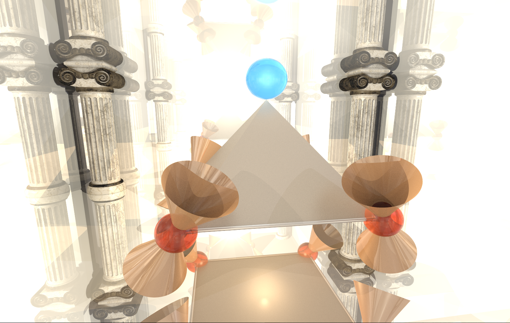
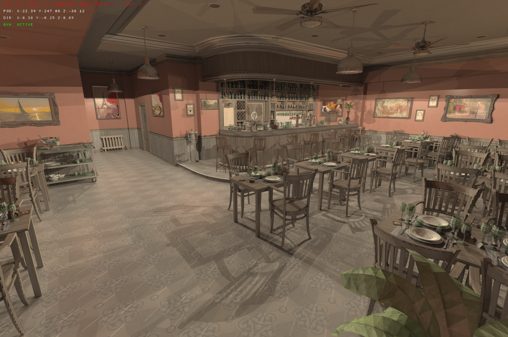
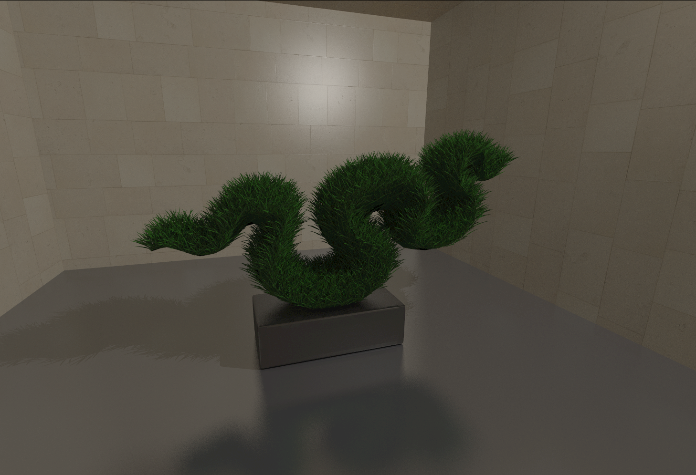

<em>This project has been created as part of the 42 curriculum by gajanvie[, jodougla].</em>

# MiniRT — My first Ray Tracer


> A complete ray tracer written in C, with support for materials, textures, BVH, multi-threading and OBJ model loading.

---

## Table of Contents

- [Introduction](#introduction)
- [The Camera, Viewport and FOV](#the-camera-viewport-and-fov)
- [Geometric Shapes](#geometric-shapes)
- [Matrices](#matrices)
- [Lighting — Phong Model](#lighting--phong-model)
- [Anti-aliasing](#anti-aliasing)
- [Textures and Visual Effects](#textures-and-visual-effects)
- [Advanced Physics — New Ray Types](#advanced-physics--new-ray-types)
- [Performance Optimizations](#performance-optimizations)
- [OBJ / MTL Format](#obj--mtl-format)
- [Optimized Parsing](#optimized-parsing)
- [Project Usage](#project-usage)
- [Controls](#controls-bonus-version)
- [Use of AI](#use-of-ai)
- [Resources](#resources)
- [End](#end)

---

## Introduction / Description

### What is Ray Tracing?

Ray tracing, also called **ray casting**, is a computer graphics optical calculation technique, used for video games, CGI special effects and animated films. It consists of tracing the path of light in reverse: instead of launching rays from the light sources, we launch everything from the camera, we look where they hit, and then we look how those places are illuminated. This advanced technique allows reproducing real-life physical phenomena such as reflection and refraction.

Ray tracing was presented for the first time by **Arthur Appel in 1968**.

It was then widely used for the creation of famous animated films or the creation of CGI special effects — films like *Toy Story* or *Finding Nemo* used ray tracing, but with rendering times of several hours for a single image.

Ray tracing requires an astronomical amount of calculation, which complicated its use in video games. But the arrival of graphics cards equipped with cores dedicated to ray tracing (**NVIDIA RTX**, **AMD RDNA2**) from 2018 marked a turning point: real-time ray tracing became a reality for gamers.

---

## The Camera, Viewport and FOV

To render a scene in ray tracing, you must first create the scene in 3D with the lights, the objects and all their attributes (size, color, transparency, …), then once the camera is placed, we position more or less far from the camera the **viewport** — a 2D screen making exactly the same size as the window, therefore exactly the same number of pixels. Afterwards we launch a ray in the middle of each pixel of the viewport and we look at what it touches in the scene. Once we know, we color the pixel with the same color as the touched object.

The FOV depends precisely on the distance and the dimension of the viewport (mainly the dimension) between the viewport and the camera.

```c
/*
    fov equation
    Height = 2 × tan(FOV/2) × FocalLength
*/
void    set_viewport(t_data *data, t_vec3 origin, t_vec3 dir, double fov)
{
    // We define the fov in radians instead of degrees because tan sin cos take radians
    data->view_port.fov_radians = data->cam.fov * (PI / 180.0);
    // We define the distance
    data->view_port.focal_length = 1.0;
    // The height will vary according to the fov, we apply the formula
    data->view_port.viewport_height = 2.0
        * tan(data->view_port.fov_radians / 2.0) * data->view_port.focal_length;
    // We look at the real window ratio between height and width
    data->view_port.aspect_ratio = (double)data->width
        / (double)data->height;
    // We apply the same ratio to obtain the viewport width using its height
    data->view_port.viewport_width = data->view_port.aspect_ratio
        * data->view_port.viewport_height;
}
```

---

## Geometric Shapes

Now that we are launching rays through the viewport, how do we know if it hits an object or not?

### The Sphere

```
t unknown, D ray direction, O origin
Ray(t) = O + t * D

c sphere center
all points f of a sphere:
||f - c|| = r
(f - c) * (f - c) = r²

We replace f with the ray:
((O + t * D) - C) * ((O + t * D) - C) = r²
(OC + TD) * (OC + TD) = r²

(a + b)² = a² + 2ab + b²

(OC * OC) + 2(OC * TD) + TD² = r²
(OC * OC) + 2t(OC * D) + t²(D * D) = r²
(OC * OC) + 2t(OC * D) + t²(D * D) - r² = 0

If this equation is true, the ray hits the sphere.
```

### The Plane

```
ray = t*D + O
plane : y = 0
t*D + O = 0
t*D = -O
t = -O / D
```

### The triangle — Möller–Trumbore algorithm

For the triangle, there exist several ways.
The most common is to make a plane from the triangle then make a plane equation,
but there is even faster: the standard algorithm of the ray tracing for triangle — **Möller–Trumbore**.
For that one uses the **barycentric coordinates** which represent the weight of the vertices.

```
In a triangle with vertices P1, P2, P3 :

any point P in the triangle can be written as :
    P = w*P1 + u*P2 + v*P3
with the constraint :
    w + u + v = 1
and

    0 ≤ u, v, w ≤ 1
One calls (w, u, v) the barycentric coordinates.
```

**Why is it perfect for a triangle ?**
A point is in the triangle if :
- `u >= 0`
- `v >= 0`
- `u + v <= 1` (because `w = 1 - u - v`)
So a simple test suffices. Moreover the interpolations are easy, so the addition of UV, normals, tangents or even gradient is rather simple.

**Unfolding of the algorithm :**

```
We start from the ray:
    R(t) = O + t * D
    O: origin of the ray
    D: direction
    t: distance along the ray

We compute the two edges of the triangle:
    E1 = P2 - P1
    E2 = P3 - P1

Then we perform some cross products to solve the system:
    H = D x E2
    a = E1 . H

If a is close to 0, the ray is parallel to the triangle → no intersection.

Otherwise we continue:
    f = 1 / a
    S = O - P1
    u = f * (S . H)
    if u < 0 or u > 1 → no intersection
    Q = S x E1
    v = f * (D . Q)
    if v < 0 or u + v > 1 → no intersection

We finally compute t, the distance along the ray:
    t = f * (E2 . Q)

If t > 0, the ray hits the triangle at the point:
    P = O + t * D

Recovered barycentric coordinates:
    u, v already computed
    w = 1 - u - v

```

The cylinder, the cone and the hyperboloid are rather similar but a bit more complex, so we’re going to skip…

---

## Matrices

In MiniRT we must be able to apply transformations to objects:
- translation (move an object)
- rotation
- scaling (scale)

These transformations can be applied to an object, a point, a ray or a normal.

To simplify all these calculations, we use **4×4 matrices**:

```
| a b c d |
| e f g h |
| i j k l |
| m n o p |
```

It allows transforming a vector or a point with a matrix multiplication.

Mathematically, a stretched sphere becomes a more complex shape (like a rugby ball). Instead of recalculating a new complicated equation, we use a trick:

1. We compute the **inverse** of the transformation matrix
2. We apply this matrix **to the ray**
3. We test the intersection with a simple sphere of radius 1

```c
// Apply the inverse matrix of a sphere to the ray
l_ray.origin = mat4_mult_vec3(&sp->inverse_transform, ray.origin, 1.0);
l_ray.dir    = mat4_mult_vec3(&sp->inverse_transform, ray.dir, 0.0);
```

> Instead of transforming the object, we transform the ray into the object's space. This allows keeping simple equations for all primitives.

---

## Lighting — Phong model


Now that we can render objects, we still need to apply normals to these objects. For this we use the **Phong model**, which works with 3 lighting components:

| Component | Description |
|---|---|
| **Ambient** | Affects any point — imitates light bouncing in real life. Ambient light is assumed to be equal everywhere in space. |
| **Diffuse** | Reflected in all directions. We take into account the surface orientation to determine brightness. |
| **Specular** | Represents light reflected in the direction of geometric reflection. This is what creates, for example, the white highlight on a strongly lit apple. |

We apply these three types of light to an object to get the final color returned by the hit point.

---

## Anti-aliasing



Anti-aliasing is also used in path tracing. It's a more optimized version of ray tracing: the more rays per pixel, the more realistic the rendering becomes.

Initially, we sent **a single ray per pixel** from the viewport, passing through the center of the pixel. The problem: if one pixel hits the sphere and the neighboring one does not, the transition is very abrupt → staircase effects.

Anti-aliasing consists of sending **multiple rays within the same pixel**, at random positions inside it, and then computing the **average of the resulting colors**. This produces a smoother image, with softer shadows and more realistic rendering.

> The downside is that this method requires much more computation: 100 rays per pixel take roughly 100× more computing time.

---

## Textures and Visual Effects

### Checkerboard Pattern

The checkerboard pattern is a procedural texture that alternates two colors to create a square effect like a chessboard.

```
Principle:
1. We get the UV coordinates of the point on the object.
2. We multiply these coordinates by a scale to control the size of the squares.
3. We apply floor() to get a square index.
4. We add the u and v indices.
   → If the result is even: color_a
   → Otherwise: color_b
```

```c
if ((floor(u * scale) + floor(v * scale)) % 2 == 0)
    color = color_a;
else
    color = color_b;
```

### UV Mapping on a Sphere

To apply a texture on a sphere, we transform the normal of the hit point into UV coordinates:

```
phi = angle around the sphere (longitude)  
theta = vertical angle (latitude)

These angles are normalized between 0 and 1 to obtain u and v.  
This allows correctly projecting a 2D texture onto a sphere.
```

### Bump Map

A bump map is used to **simulate surface relief** without modifying the object's geometry.

```
Principle:
- We use a texture (often in grayscale).
- The texture value slightly modifies the surface normal.
- Lighting reacts as if the surface had bumps or indentations.

Important:
- The actual shape of the object does not change.
- Only the lighting calculation is affected.
```

> Result: a low-computation relief effect — you can see crack patterns on asphalt or ripples on water.

---

## Advanced Physics — New Ray Types


To push realism further, we can add **bounces** to rays on surfaces.

### Specular Rays (Mirrors)

Specular rays allow creating mirrors — they perform perfect bounces. For a metallic effect, I added **roughness** which slightly perturbs the bounces to create a metallic blur.

The method used is called **sphere fuzz**: at the end of the perfect bounce, we create a circle sized according to the roughness rate, and the ray bounces toward a random point within this circle.

### Diffuse Rays

Diffuse rays create a lot of noise if the number of rays per pixel is low, as they send a ray in a completely random direction. The hit point becomes a light source for the originally hit object. This noise is mitigated by anti-aliasing.

### Refracted Rays (Transparency)

Refracted rays allow simulating transparent materials. Refraction corresponds to how light passes through different substances (oil, diamond, etc.) in a realistic way.

---

## Performance Optimizations


To keep rendering fast even with very complex scenes (many objects or thousands of triangles like in `dragon.obj`), MiniRT uses two major optimizations.

### BVH — Bounding Volume Hierarchy

Instead of testing each ray against all objects in the scene one by one, the program organizes all objects into a **hierarchical tree of bounding volumes** (boxes). Each node in the tree represents a box containing either objects or smaller boxes. This allows the ray to skip entire regions of the scene that are not relevant.

The tree is intelligently built using the **SAH** (Surface Area Heuristic). This method calculates, for each possible split, the surface cost and chooses the best way to separate objects to minimize unnecessary tests.

### Thread Pool

Image computation is done in parallel across multiple CPU cores. Instead of creating and destroying threads each time, MiniRT uses a **thread pool** that keeps a group of threads ready to work.

The program divides the image into small blocks of pixels and automatically distributes them to available threads using the functions in the `thread_pool/` folder. Each thread computes its portion of the image simultaneously. Each core processes a number `n` of pixel blocks.

---

## OBJ / MTL Format



MiniRT can load realistic 3D models thanks to the `.obj` format accompanied by its material file `.mtl`.

The `.obj` format (created in the 1980s by Wavefront) is one of the most widely used 3D formats. It contains:
- Vertices
- Normals
- Triangular faces

The `.mtl` file describes the associated material properties: colors (`Kd` for diffuse, `Ks` for specular), shininess (`Ns`), textures, opacity, refractive index (`Ni`), etc.

Thanks to this format, we can load complex objects like the dragon, the airplane (`f16.obj`), Shrek, or the rabbit (`bun_small.obj`). Even though this format is a bit old, it remains very practical and widely supported by all 3D software (Blender, Maya…).

---

## Optimized Parsing

To quickly load large `.obj` files that can contain tens of thousands of triangles, I used the system functions `mmap` and `realloc`.

Unlike the classic line-by-line reading with `getline` or `fscanf`, `mmap` maps the entire file directly into memory as if it were part of the program. This makes data access much faster.

The parser simultaneously processes:
- Geometry (triangles, normals, vertices)
- Materials from the associated `.mtl` file

---

## Utilisation du projet / Instructions

```bash
make # mandatory version
make bonus # “goat” version (recommended)
```

```bash
./minirt_bonus <scenes.rt>
```

> Many already nice scenes are available in the folder `scenes/`

---

## Controls (bonus QWERTY version)

| Key | Action |
|--------|--------|
| `W` `A` `S` `D` | Movement |
| `↑` `↓` `←` `→` | Camera movement |
| `Space` | Move up |
| `Right Shift` | Move down |
| `[` `]` | Rotate scene around Z-axis |
| `-` / `=` | Decrease / increase FOV |
| `0` / `9` | Increase / decrease number of bounces |
| `1` | 1 sample per pixel |
| `2` | 5 samples per pixel |
| `3` | 10 samples per pixel |
| `4` | 30 samples per pixel |
| `5` | 100 samples per pixel |
| `C` | Toggle checkerboard pattern view |
| `Del` | Toggle diffuse bounces |
| `Ctrl` | Toggle speed mode |
| `Enter` | Toggle BVH |
| `B` | Toggle BVH debug view |
| `L` | Toggle task distribution view |
| `Esc` | Quit |

---

## Use of AI

For this project, I barely used AI. I mainly used it to understand certain mathematical formulas, especially those for the hyperboloid. At first, I didn’t fully understand these formulas, so I asked AI to explain them. I prefer this rather than writing something I don’t understand.

For most other shapes, the available documentation is very clear and complete, but some subtleties are less well explained, which led me to ask for a few clarifications.

I also used AI to rephrase or improve some `.rt` files to have style maps or MTLs to obtain more realistic materials. This was therefore not code generation, but rather assistance for writing and adjusting visual parameters. I also asked AI for help with the markdown and translation of this README, originally written in French, but all the content was written by hand (thanks to Reverso for correcting spelling mistakes).

## Resources

> Many sources are missing; here are the ones I had noted.

---

**Ray Tracing — Basics**

- *<sub>https://www.scratchapixel.com/lessons/3d-basic-rendering/ray-tracing-generating-camera-rays/generating-camera-rays.html</sub>*
- *<sub>https://raytracing.github.io/books/RayTracingInOneWeekend.html</sub>* — thanks for this guide, it’s a very good starting point for learning from scratch…
- *<sub>https://fr.wikipedia.org/wiki/Ray_tracing</sub>*
- *<sub>https://www.scratchapixel.com/lessons/3d-basic-rendering/ray-tracing-overview/light-transport-ray-tracing-whitted.html</sub>*

**Videos**

- *<sub>https://www.youtube.com/watch?v=iOlehM5kNSk&t=1202s</sub>* — the best video ever on ray tracing
- *<sub>https://www.youtube.com/watch?v=Qz0KTGYJtUk</sub>* — thank you so much, it gave me tons of ideas and many answers…

**Geometric Shapes**

- *<sub>http://heigeas.free.fr/laure/ray_tracing/sphere.html</sub>*
- *<sub>http://heigeas.free.fr/laure/ray_tracing/cylindre.html</sub>*
- *<sub>https://www.britannica.com/science/hyperboloid</sub>*

**OBJ / MTL Format**

- *<sub>https://en.wikipedia.org/wiki/Wavefront_.obj_file</sub>*
- *<sub>https://www.fileformat.info/format/wavefrontobj/egff.htm</sub>*
- *<sub>https://people.sc.fsu.edu/~jburkardt/data/mtl/mtl.html</sub>*

**Lighting & Phong**

- *<sub>https://fr.wikipedia.org/wiki/Ombrage_de_Phong</sub>*
- *<sub>https://rodolphe-vaillant.fr/entry/85/phong-illumination-model-cheat-sheet</sub>*
- *<sub>https://www.povray.org/documentation/view/3.60/348/</sub>*
- *<sub>https://computergraphics.stackexchange.com/questions/9065/diffuse-lighting-calculations-in-ray-tracer</sub>*

**Reflection, Refraction & Fresnel**

- *<sub>https://blog.demofox.org/2017/01/09/raytracing-reflection-refraction-fresnel-total-internal-reflection-and-beers-law/</sub>*
- *<sub>https://fr.wikipedia.org/wiki/Coefficients_de_Fresnel</sub>*
- *<sub>https://nano-optics.ac.nz/planar/articles/fresnel.html</sub>*
- *<sub>https://www.rp-photonics.com/fresnel_equations.html</sub>*
- *<sub>https://fr.wikipedia.org/wiki/Loi_de_Beer-Lambert</sub>*
- *<sub>https://learn.arm.com/learning-paths/mobile-graphics-and-gaming/ray_tracing/rt08_refractions/</sub>*
- *<sub>https://stackoverflow.com/questions/26087106/refraction-in-raytracing</sub>*

**Roughness & Anti-Aliasing**

- *<sub>https://computergraphics.stackexchange.com/questions/4486/mimicking-blenders-roughness-in-my-path-tracer</sub>*
- *<sub>https://computergraphics.stackexchange.com/questions/4248/how-is-anti-aliasing-implemented-in-ray-tracing</sub>*
- *<sub>https://www.cs.utexas.edu/~fussell/courses/cs384g-fall2010/lectures/lecture10-Aa_and_accel_raytracing.pdf</sub>*

**BVH & Matrices**

- *<sub>https://www.lufei.ca/posts/BVH.html</sub>*
- *<sub>https://fileadmin.cs.lth.se/cs/Education/EDAN35/projects/2022/Sanden-BVH.pdf</sub>*
- *<sub>https://hackmd.io/@zOZhMrk6TWqOaocQT3Oa0A/HJUqrveG5</sub>*
- *<sub>https://fr.wikipedia.org/wiki/Hi%C3%A9rarchie_des_volumes_englobants</sub>*
- *<sub>https://fr.wikipedia.org/wiki/Calcul_du_d%C3%A9terminant_d%27une_matrice</sub>*
- *<sub>https://www.ck12.org/flexi/fr/precalcul/determinant-des-matrices/comment-calculer-le-determinant-d%27une-matrice-4x4/</sub>*

**Textures & UV Mapping**

- *<sub>https://fr.wikipedia.org/wiki/Cartographie_UV</sub>*
- *<sub>https://fr.wikipedia.org/wiki/Placage_de_relief</sub>*
- *<sub>https://perso.esiee.fr/~buzerl/sphinx_IMA/50%20bump/bump.html</sub>*
- *<sub>https://en.wikipedia.org/wiki/Bump_mapping</sub>*

**Barycentric Coordinates**

- *<sub>https://fr.wikipedia.org/wiki/Coordonn%C3%A9es_barycentriques</sub>*
- *<sub>https://agreg-maths.univ-rennes1.fr/documentation/docs/agregbary.pdf</sub>*

## Fin

Ray Tracing combines many subjects: physics, optics, mathematics, linear algebra, trigonometry, geometry, algorithms, data structures, parallel computing, probability, statistics, as well as programming and software optimization.  
This project is one that I cared about deeply. I had a lot of intense coding sessions, but I’m excited to revisit it to improve it...

---



<div align="center">
Made by gajanvie alias CHAT-DISPARU
</div>

